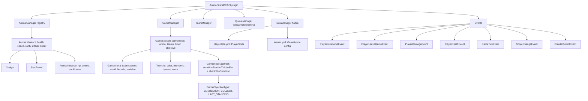
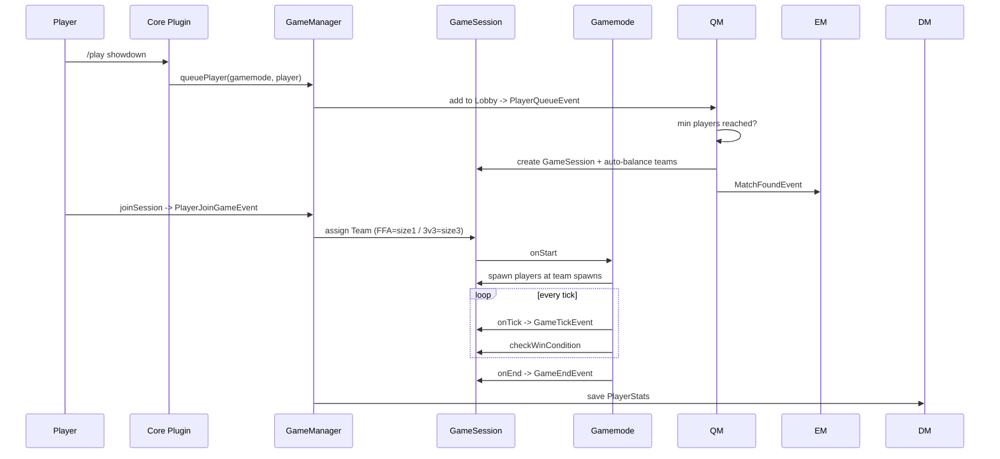

# AnimalStarsMC API — Extension Plan (Animal Stars, Brawl Stars-like)

## Goal
Extend the current API so it can serve as the shared dependency for the **core** and **gamemode** plugins of an Animal Stars (Brawl Stars-like) game, where playable characters are **Animals** rather than Brawlers.

## Current State (what exists)
- `GameManager` (string-keyed game modes, flat `List<Player>`)
- `GameState` enum (WAITING/STARTING/PLAYING/ENDING/ENDED)
- `GameArena` (hardcoded spawn1..4, no world/bounds/serialization)
- `PlayerStats` + `PlayerManager` (in-memory only)
- Events: `GameStartEvent`, `GameEndEvent`, `PlayerKillEvent`
- Utils: `ItemBuilder`, `Messages`

## Decisions (confirmed with user)
1. Brawler/Animal + Gamemode interfaces live **in the API**.
2. Persistence = **Flatfile (YAML)**.
3. Gamemodes to support first: **Showdown (8 FFA)**, **Gem Grab (3v3)**, **Knockout (3v3)**.

## Target Architecture

## Game flow (Showdown / Gem Grab / Knockout)

## Work Breakdown (todo list)

1. **Team system** — `Team` (id, color, members, spawn, score) + `TeamManager`. Supports FFA (teamSize 1) and 3v3.
2. **Animal abstraction** — abstract `Animal` (health, move speed, rarity, attack, super), `Gadget`, `StarPower`, `AnimalManager` registry, `AnimalInstance` (per-player hp/ammo/cooldowns).
3. **Gamemode framework** — abstract `Gamemode` (onInit/onStart/onTick/onEnd + checkWinCondition), `GameObjectiveType` enum, registration in `GameManager`.
4. **Refactor GameArena** — per-team spawns, world reference, bounds/region, YAML serialize/deserialize.
5. **Refactor GameManager + GameSession** — replace string maps with `GameSession` objects tying gamemode + arena + teams + timer + objective state.
6. **Lobby/Queue/Matchmaking** — `Lobby` per gamemode (waiting players), `QueueManager` (auto-balance into teams/sessions when min players reached), events `PlayerQueueEvent`, `PlayerDequeueEvent`, `MatchFoundEvent`.
7. **Missing events** — PlayerJoinGame, PlayerLeaveGame, PlayerDamage, PlayerDeath, GameTick, ScoreChange, BrawlerSelect.
7. **Flatfile persistence** — `DataManager` saving/loading `PlayerStats` and arena configs under `plugins/AnimalStarsMC-API/data`.
8. **HUD/Scoreboard framework** — `ScoreboardBuilder` for timers, scores, brawler info.
9. **Usage docs/example** — how core + gamemode plugins `depend: [AnimalStarsMC-API]`, register brawlers/gamemodes, and consume events.

## Notes
- The API remains a `JavaPlugin` (loads first); core/gamemode plugins access it via `AnimalStarsMCAPI.getInstance()`.
- Existing `GameStartEvent`/`GameEndEvent`/`PlayerKillEvent` are kept; new events are additive.
- `PlayerStats` extended to persist trophies/coins per player (global for v1; per-brawler later if needed).
